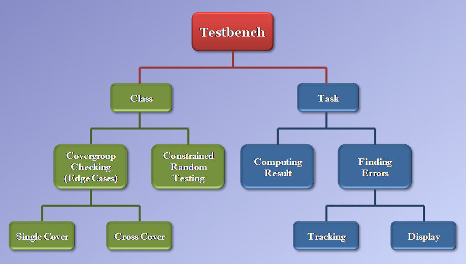
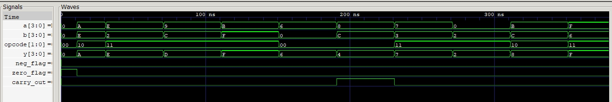

# 4-bit ALU — Constrained-Random Verification

A 4-bit ALU (add, subtract, AND, OR, with zero/negative/carry flags) verified with a class-based, mailbox-connected testbench using actual `rand`/`constraint` stimulus and `covergroups`. Built using Aldec Riviera-Pro through EDA Playground, back when it was accessible
without a corporate email. That access has since been locked down like the other commercial simulators, which is the reason why the [Universal Shift Register project](../universal-shift-register) had to fall back to manual randomization and manually-coded coverage tracking instead.

## Architecture



## Result

```
Functional Coverage: 100.00%

=====================================================
              FINAL VERIFICATION SUMMARY
=====================================================
 Total Passed: 5000
 Total Failed: 0
=====================================================
>>>> SIMULATION PASSED <<<<
```



## Design Notes

Subtraction computes `a - b` unconditionally and lets it wrap on unsigned underflow, instead of branching the arithmetic on `a >= b`, giving correct 2's-complement behavior without building sign-magnitude subtraction.

The coverage cross (`X_a_b_opcode`) skips bins where the opcode is AND/OR with both operands mid-range which don't stress anything, so tracking them would just be wastage of CPU cycles. The bins that matter are the ones near overflow/underflow and the opcode/flag interactions.

## File Hierarchy

| File | Role |
|---|---|
| [`alu.sv`](alu.sv) | RTL — combinational ALU: add/subtract/AND/OR with flags |
| [`alu_if.sv`](alu_if.sv) | Interface + clocking block |
| [`alu_item.sv`](alu_item.sv) | Transaction object, `rand` fields, weighted opcode `dist` constraint |
| [`alu_generator.sv`](alu_generator.sv) | Drives `randomize()`, 5000 transactions |
| [`alu_driver.sv`](alu_driver.sv) | Drives transactions onto the virtual interface |
| [`alu_monitor.sv`](alu_monitor.sv) | Samples the virtual interface each cycle |
| [`alu_scoreboard.sv`](alu_scoreboard.sv) | Golden reference model, self-checking pass/fail |
| [`alu_coverage.sv`](alu_coverage.sv) | Covergroup with coverpoints and cross coverage |
| [`alu_environment.sv`](alu_environment.sv) | Wires everything together |
| [`alu_pkg.sv`](alu_pkg.sv) / [`alu_tb.sv`](alu_tb.sv) | Package and top-level testbench |

## Compilation & Simulation

```bash
python run.py
```

Configures the Questa workflow (compile, elaborate, simulate) and runs all 5000 transactions in one pass. Console output shows the running pass/fail count as it goes, and the coverage summary is printed once the environment's `#100` drain window finishes.
