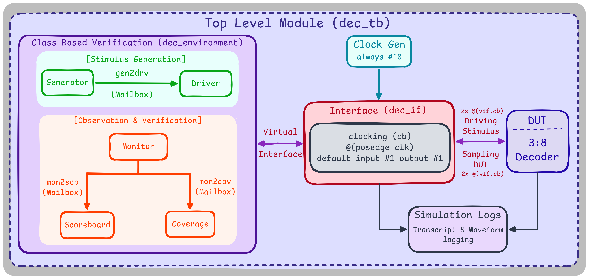
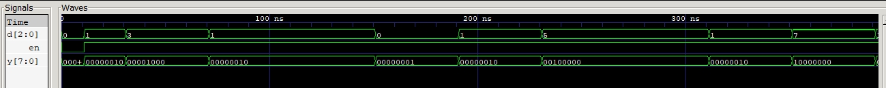

# 3-to-8 Decoder — X-Propagation & Enable Coverage

A 3-to-8 decoder with enable (parameterized, scales with `2**WIDTH`), verified with the same mailbox-connected, class-based testbench structure as the other Questa-era projects. Built after the [priority encoder](../priority-encoder), with stimulus that specifically exercises an unknown/uninitialized signal state, and a clocking skew fix that was revised after an earlier version silently dropped a transaction.

## Architecture



## Result

```
===================================================
               COVERAGE SUMMARY
===================================================
 Enable Cover: Covered
 Disable Cover: Covered
 Input Cover with Enable: 8/8, 100.00%
===================================================
 Total Coverage: 100.00%
===================================================
             FINAL VERIFICATION SUMMARY
===================================================
 Total Passed: 1000
 Total Failed: 0
===================================================
>>>> SIMULATION PASSED <<<<
```



## Testing the Unknown Case

The generator's last transaction deliberately sends `d` and `en` as `'x` (unknown) instead of a normal randomized value to check how the DUT handles it. The scoreboard compares with `===` (4 state case equality) operator instead of `==` to make sure it evaluates the unknown state correctly.

## Driver-Monitor Skew

A single clocking block wait should clear the offset of driver and monitor by giving the monitor buffer time before sampling. But, its caveat is that it truncates the first transaction, resulting in a mismatch with the `loop_count`. Reverted it back to the 2 cycle `@(vif.cb)` wait for each transaction, just like in the [Priority Encoder](../priority-encoder) which ensures that the data becomes stable before driving or sampling.

## File Hierarchy

| File | Role |
|---|---|
| [`dec.sv`](dec.sv) | RTL - parameterized combinational decoder with enable |
| [`dec_if.sv`](dec_if.sv) | Interface + clocking block |
| [`dec_item.sv`](dec_item.sv) | Transaction object |
| [`dec_generator.sv`](dec_generator.sv) | Stimulus generation, including a deliberate `'x` transaction at the end |
| [`dec_driver.sv`](dec_driver.sv) | Drives transactions onto the virtual interface |
| [`dec_monitor.sv`](dec_monitor.sv) | Samples the virtual interface, 2x @(vif.cb) per item |
| [`dec_scoreboard.sv`](dec_scoreboard.sv) | Golden reference model, `===` case equality comparison for `x` matching |
| [`dec_coverage.sv`](dec_coverage.sv) | Manual coverage: enable/disable state, input value coverage while enabled |
| [`dec_environment.sv`](dec_environment.sv) | Wires everything together |
| [`dec_pkg.sv`](dec_pkg.sv) / [`dec_tb.sv`](dec_tb.sv) | Package and top-level testbench |

## Compilation & Simulation

```bash
python run.py
```

Configures the Questa flow (`vlib`/`vmap`/`vlog`/`vsim`) and appends each run's transcript to `simulation_history.log`.