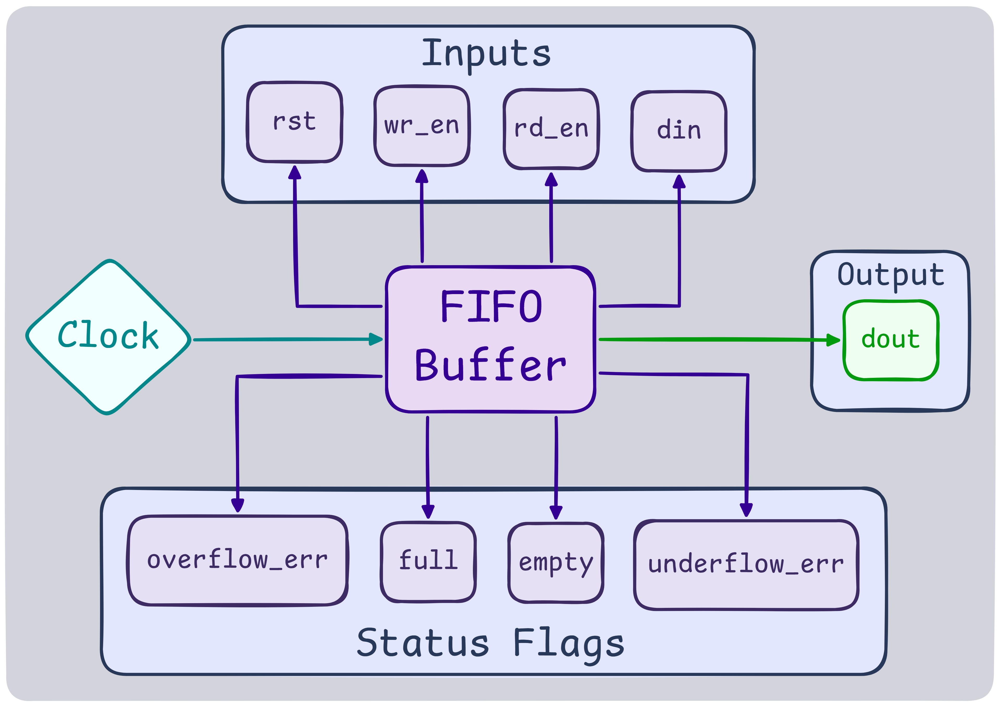
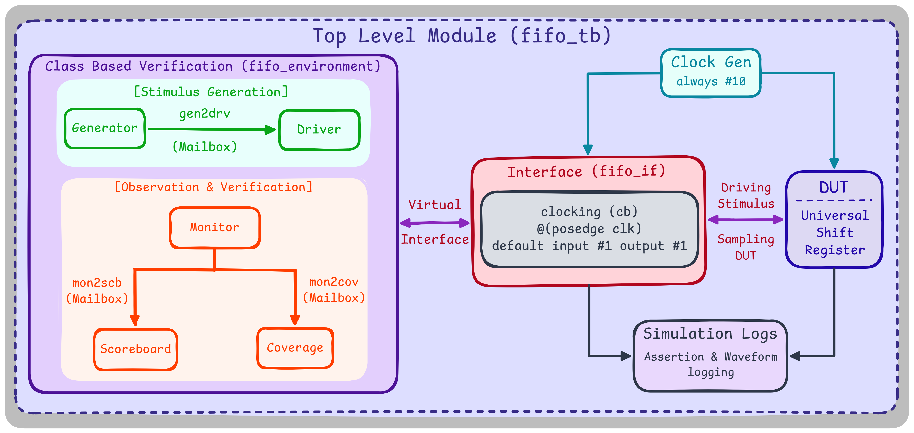

# Synchronous FIFO Buffer — Coverage-Driven Verification

A parameterized synchronous FIFO buffer (DATA_WIDTH = 8, MEMORY_DEPTH = 16) verified with the same self-built, class-based testbench methodology as the other projects in this repo: mailbox-connected generator/driver/monitor, a golden reference model for scoreboard, and manually-coded functional coverage.

As with the other projects, Questa (Altera FPGA Starter Edition 25.1) doesn't support `rand`/`constraint` or `covergroup` (no `svverification` license), so stimulus is generated with `$urandom_range` and coverage is tracked with 9 manually coded boolean bins instead of covergroups.

## Architecture

### RTL


### Testbench


## Result

```
===================================================
               COVERAGE SUMMARY
===================================================
 Reset Cover: Covered
 Write Enable Cover: Covered
 Read Enable Cover: Covered
 Data Input Cover: Covered
 Data Output Cover: Covered
 Empty Cover: Covered
 Full Cover: Covered
 Overflow Error Cover: Covered
 Underflow Error Cover: Covered
===================================================
 Total Coverage: 100.00%
===================================================
           FINAL VERIFICATION SUMMARY
===================================================
 Total Passed: 1000
 Total Failed: 0
===================================================
>>>> SIMULATION PASSED <<<<
```


## The Bug (RTL side): Pointer fullness tracking and pulse vs. latch flags

The hard part wasn't the read/write logic itself — it was two decisions that look trivial on paper but are not.

First: wr_ptr == rd_ptr is ambiguous. It's true both when the FIFO is empty and when it's completely full, and nothing in the address bits themselves can tell you which. The fix is to widen each pointer by one bit beyond what's needed to index the memory, and let that extra MSB carry the disambiguation — full when the address bits match but the MSBs don't, empty when both match exactly. Understanding why that bit works (it's tracking how many times each pointer has wrapped, not extra address space) took longer than actually writing the RTL for it.

Second: overflow_err and underflow_err are supposed to be single-cycle pulses that fire on the illegal attempt — a write while full, a read while empty — not persistent status flags. My first pass held them high for as long as the illegal condition kept being requested, which is a latch, not a pulse, and it's the wrong semantic: it reports "the FIFO has been full and someone keeps trying," when what the flag should report is "an illegal access happened, right now." Getting the deassertion ('0) placed correctly in the always block so the flag reasserts exactly on the triggering cycle and clears the next one — rather than staying latched until the condition changes — was the fiddliest part of the whole design.

## One-cycle offset Testbench: Simultaneous Read and Write Enable

Directed stimulus alongside the randomized loop. The generator doesn't rely purely on randomization — it opens with two manual reset transactions, then one deliberate read-while-empty transaction before any data has been written, specifically to force an underflow case on the very first real access rather than hoping $urandom_range stumbles into it. The main loop then switches to randomized din with wr_en held high throughout, but gates rd_en behind rd >= 20, so reads never turn on until the FIFO has had 20 cycles to fill — this keeps wr_en and rd_en from both going high on cycle one, which would otherwise race the empty flag before there's anything meaningful to read. Periodic resets are injected every 20 transactions (swerve % 20 == 0) to catch behavior across reset boundaries mid-stream, not just at the start.

Scoreboard: full and empty tracked independently of the golden model. The scoreboard still checks dout against a golden reference model, the same approach as the other projects — but full and empty are computed as their own separate signals rather than derived from the reference model's state. This mirrors how the DUT itself computes them (as independent assign statements off the pointer comparison, not as a byproduct of the data path), so the scoreboard is actually checking the same thing the RTL is asserting, rather than checking a value that happens to usually agree with it.

## File Hierarchy

Files are organized into `rtl/`, `testbench/`, and `sim/` (with a `files.f` filelist used for compilation), rather than the flat layout used in earlier projects:

| Folder | Contents |
|---|---|
| `rtl/` | FIFO RTL — parameterized synchronous FIFO with extra-MSB pointer fullness tracking |
| `testbench/` | Class-based testbench: `fifo_item`, `fifo_generator`, `fifo_driver`, `fifo_monitor`, `fifo_scoreboard`, `fifo_coverage`, `fifo_environment`, `fifo_pkg`, `fifo_tb` |
| `sim/` | `files.f` filelist and run.py simulation script |
| `docs/` | Architecture diagrams, waveform screenshot and coverage summary |

## Compilation & Simulation

```bash
python run.py
```

Executes the Questa workflow (`vlib`/`vmap`/`vlog`/`vsim`) using the `sim/files.f` filelist, and appends each run's transcript to `simulation_history.log`.
