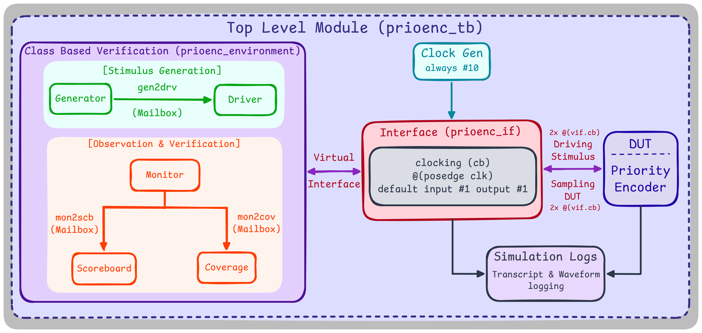
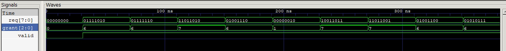

# 8-bit Priority Encoder — Coverage-Driven Verification

An 8-to-3 priority encoder (parameterized, scales with `$clog2`) verified with the mailbox-connected, class-based, multi-layered testbench structure: generator, driver, monitor, scoreboard, a golden reference model, and manual coverage. This was the first project to be built on Questa before the [USR](../universal-shift-register) was made so `rand`/`constraint`/`covergroup` weren't available on this setup either. Coverage was tracked manually with plain arrays and stimulus was randomized using `$urandom_range`.

## Architecture



## Result

```
===================================================
               COVERAGE SUMMARY
===================================================
 Grant cover: 8/8, 100.00%
 Valid cover: 2/2, 100.00%
 Hot Req: Covered
 Cold Req: Covered
===================================================
 Total Coverage: 100.00%
===================================================
             FINAL VERIFICATION SUMMARY
===================================================
 Total Passed: 5000
 Total Failed: 0
===================================================
>>>> TEST PASSED <<<<
```



## The Bug: Clocking skew between driver and monitor 

The DUT is purely combinational, but the interface's `input #1 output #1` clocking-block skew still creates a 1-cycle lag: sampling `grant`/`valid` right after a single `@(vif.cb)` picks up the response to the *previous* request, not the current one just driven. Fixed by waiting `@(vif.cb)` twice in both the driver and the monitor, giving the clocking block's skew a full cycle to resolve before anything is driven or sampled.

## Test Design

The generator deliberately drives an all-zero `req` first, then guarantees every request after that is non-zero so the `cold_request` (`valid=0`) edge case is hit for certain on cycle one, rather than relying upon the random generator to cover it. The rest of the run stress-tests actual grant resolution across all 8 request lines.

## File Hierarchy

| File | Role |
|---|---|
| [`prioenc.sv`](prioenc.sv) | RTL - parameterized combinational priority encoder |
| [`prioenc_if.sv`](prioenc_if.sv) | Interface + clocking block |
| [`prioenc_item.sv`](prioenc_item.sv) | Transaction object |
| [`prioenc_generator.sv`](prioenc_generator.sv) | Stimulus generation (`$urandom_range`), guarantees the zero-request case |
| [`prioenc_driver.sv`](prioenc_driver.sv) | Drives transactions onto the virtual interface, 2x @(vif.cb) |
| [`prioenc_monitor.sv`](prioenc_monitor.sv) | Samples the virtual interface, 2x @(vif.cb) |
| [`prioenc_scoreboard.sv`](prioenc_scoreboard.sv) | Golden reference model, self-checking pass/fail |
| [`prioenc_coverage.sv`](prioenc_coverage.sv) | Manual coverage: grant bins, valid states, hot/cold request edge cases |
| [`prioenc_environment.sv`](prioenc_environment.sv) | Wires everything together, runs 5000 transactions |
| [`prioenc_pkg.sv`](prioenc_pkg.sv) / [`prioenc_tb.sv`](prioenc_tb.sv) | Package and top-level testbench |

## Compilation & Simulation

```bash
python run.py
```

Executes the Questa flow (`vlib`/`vmap`/`vlog`/`vsim`) and appends each run's transcript to `simulation_history.log`.