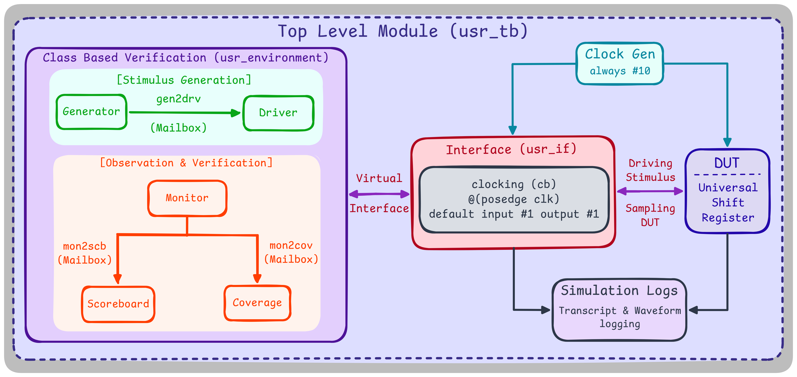
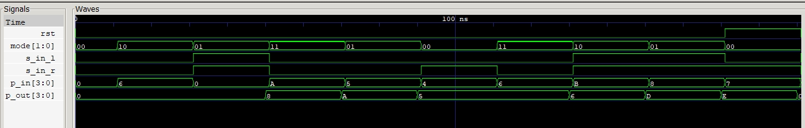

# Universal Shift Register — Coverage-Driven Verification
 
A 4-bit Universal Shift Register (parameterized, so it scales to any width) verified with a self-built, class-based testbench: mailbox-connected to generator/driver/monitor, a golden reference model for scoreboard, and manually-coded functional coverage.
 
Questa (Altera FPGA Starter Edition 25.1) doesn't include `rand`/`constraint` or `covergroup` support as it lacks `svverification` features, so this isn't UVM or constrained-random in the usual sense as stimulus is generated with `$urandom_range`, and coverage is tracked with 85 hand-coded boolean bins instead of covergroups. It's more manual work than a standardized flow, but it forced me to actually think through what "covered" means for every signal instead of letting a covergroup do it for me.
 
## Architecture
 

 
## Result
 
```
 Reset Cover: Covered
 Mode Cover: 4/4, 100.00%
 S_In Left Cover: Covered
 S_In Right Cover: Covered
 P_In Cover: 16/16, 100.00%
 P_Out Cover: 16/16, 100.00%
 Other(s) Cover: 46/46, 100.00%
 Total Coverage: 100.00%
 
 Total Passed: 5000
 Total Failed: 0
 >>>> SIMULATION PASSED <<<<
```
 

 
## The Bug: A 2-cycle offset between stimulus and observed output
 
The interface uses a clocking block with `input #1 output #1` skew; standard practice to avoid race conditions between the driver and the DUT. But it means `p_out` isn't valid at the monitor until 1 cycle after it's valid at the DUT pin, and combined with the mailbox communication between driver and monitor, the *input* that the monitor should pair with a given `p_out` sample is actually 2 cycles behind the input which is currently on the bus, not the one idling on the current cycle of the clock.
 
First test at the monitor paired inputs and outputs in the same cycle, and the scoreboard threw mismatches that weren't real bugs. The DUT was correct, the checking was misaligned. Fixed it by priming the monitor with 2 clocking-block edges before sampling starts, and keeping a 1-cycle history buffer of inputs so each `p_out` sample gets compared against the input that was actually driving the DUT when the DUT produced it, not against the input on the bus at sample time.
 
## File Hierarchy
 
| File | Role |
|---|---|
| [`usr.sv`](usr.sv) | RTL — parameterized shift register, mode-selected hold/shift-left/shift-right/parallel-load |
| [`usr_if.sv`](usr_if.sv) | Interface + clocking block |
| [`usr_item.sv`](usr_item.sv) | Transaction object |
| [`usr_generator.sv`](usr_generator.sv) | Stimulus generation (`$urandom_range`, no `rand`/`constraint`) |
| [`usr_driver.sv`](usr_driver.sv) | Drives transactions onto the DUT through `vif` |
| [`usr_monitor.sv`](usr_monitor.sv) | Samples the DUT using `vif`, handles the 2-edge priming described above |
| [`usr_scoreboard.sv`](usr_scoreboard.sv) | Golden reference model, self-checking pass/fail |
| [`usr_coverage.sv`](usr_coverage.sv) | 85 manually-coded coverage bins |
| [`usr_environment.sv`](usr_environment.sv) | Wires everything together, runs 5000 transactions |
| [`usr_pkg.sv`](usr_pkg.sv) / [`usr_tb.sv`](usr_tb.sv) | Package and top-level testbench |
 
## Compilation & Simulation
 
```bash
python run.py
```
 
Executes the Questa workflow (`vlib`/`vmap`/`vlog`/`vsim`) in a single `run.py` script and appends each run's transcript to `simulation_history.log`.
